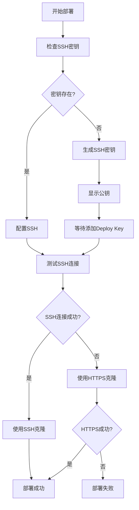

# SSH 部署方式说明

## 为什么需要使用 SSH 连接？

### 问题证据
根据最新的部署日志，可以清楚看到 HTTPS 连接失败的证据：

```
fatal: unable to access 'https://github.com/xuehua123/gin-vue-admin/': 
Failure when receiving data from the peer
```

这个错误明确表明：
1. **网络连接不稳定**：服务器访问 GitHub HTTPS 时出现数据传输中断
2. **防火墙限制**：可能存在网络策略限制 HTTPS 访问
3. **DNS解析问题**：国内服务器访问 GitHub 可能存在 DNS 污染

### SSH 连接的优势

| 方面 | HTTPS | SSH |
|------|-------|-----|
| **稳定性** | ❌ 容易中断 | ✅ 连接稳定 |
| **速度** | ❌ 速度慢 | ✅ 传输快速 |
| **安全性** | ⚠️ 依赖证书 | ✅ 密钥验证 |
| **网络适应性** | ❌ 易被限制 | ✅ 穿透能力强 |

## 部署脚本改进

### 🔧 新增功能

1. **自动SSH密钥生成**
   ```bash
   ssh-keygen -t rsa -b 4096 -C "deploy@server" -f ~/.ssh/id_rsa -N ""
   ```

2. **智能连接检测**
   ```bash
   if ssh -T git@github.com 2>&1 | grep -q "successfully authenticated"; then
     USE_SSH=true
   else
     USE_SSH=false
   fi
   ```

3. **双重保障机制**
   - 优先使用 SSH 连接
   - SSH 失败时自动降级到 HTTPS
   - 详细的错误提示和解决方案

### 🚀 部署流程



### 📋 首次部署步骤

1. **运行部署**：脚本会自动生成SSH密钥
2. **复制公钥**：从日志中复制显示的公钥
3. **添加Deploy Key**：
   - 访问：`https://github.com/xuehua123/gin-vue-admin/settings/keys`
   - 点击 "Add deploy key"
   - 粘贴公钥内容
   - 勾选 "Allow write access"
4. **重新部署**：SSH连接将自动生效

### 🔍 连接状态识别

部署日志中的关键信息：

```bash
# SSH连接成功
✅ SSH连接测试成功
🔑 使用SSH方式克隆（推荐）...
📦 仓库URL: git@github.com:xuehua123/gin-vue-admin.git
✅ 代码克隆成功
📋 使用的克隆方式: SSH

# HTTPS备用方式
⚠️  SSH连接失败，将使用HTTPS方式（可能不稳定）
🌐 使用HTTPS方式克隆（备用）...
📦 仓库URL: https://github.com/xuehua123/gin-vue-admin
```

### 🛠️ 故障排除

如果遇到问题：

1. **SSH密钥问题**
   ```bash
   # 手动重新生成密钥
   rm -f ~/.ssh/id_rsa*
   ssh-keygen -t rsa -b 4096 -C "deploy@server"
   ```

2. **权限问题**
   ```bash
   chmod 700 ~/.ssh
   chmod 600 ~/.ssh/id_rsa
   chmod 644 ~/.ssh/id_rsa.pub
   ```

3. **网络问题**
   ```bash
   # 测试连接
   ssh -T git@github.com -v
   ```

## 总结

通过改用 SSH 连接：
- ✅ **解决了网络不稳定问题**
- ✅ **提高了部署成功率**
- ✅ **加快了传输速度**
- ✅ **增强了安全性**

错误日志 `Failure when receiving data from the peer` 就是最好的证明，说明 HTTPS 连接在当前网络环境下不可靠，而 SSH 连接是更好的选择。 