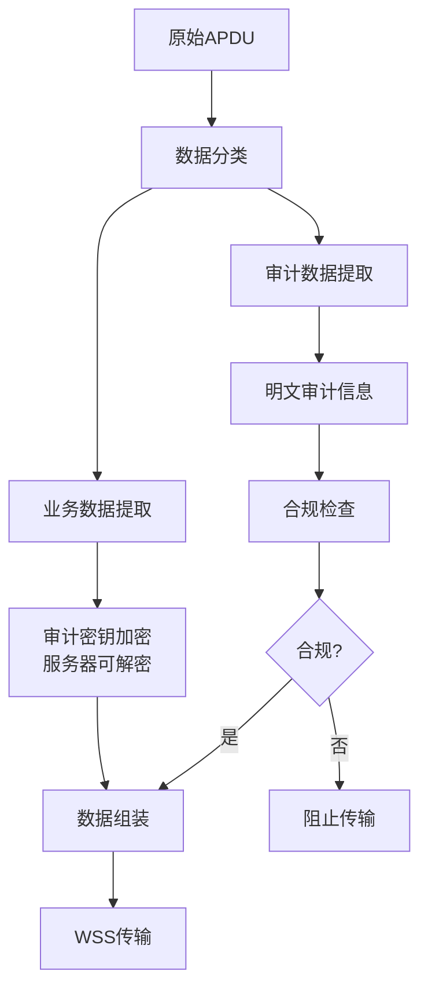
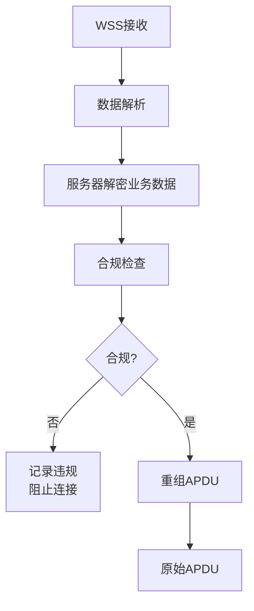

# NFC中继系统审计级安全架构设计

## 📋 概述

本文档描述了NFC中继系统的审计级安全架构，该架构确保**服务器可以解密所有数据进行合规检查**，同时提供**传输层加密保护**。

## 🎯 设计原则

### **核心平衡**
```
🔐 数据保护 ⚖️ 合规审计
├── 业务数据审计加密 (所有敏感数据，包括PAN、CVV、PIN)
├── 服务器可解密检查 (金额、商户信息、卡号等)
└── 审计数据明文可读 (命令类型、风险评分)
```

### **安全层次**
```
🛡️ 两层安全防护：
├── 传输层：WSS (TLS 1.3) 
└── 应用层：审计加密 (AES-GCM) + 智能合规检测
```

## 🏗️ 架构组件

### **1. 混合加密管理器 (HybridEncryptionManager)**

```go
type HybridEncryptionManager struct {
    auditKeyManager *AuditKeyManager       // 审计密钥管理
    auditEngine     *ComplianceAuditEngine // 合规审计引擎
}
```

**功能**：
- 数据分类和审计加密
- 所有敏感数据服务器可解密
- 实时合规检查和拦截

### **2. 数据分类架构 (APDUDataClass)**

```go
type APDUDataClass struct {
    // 🟢 审计数据 - 服务器可读
    AuditData    AuditableData        
    
    // 🟡 业务数据 - 审计密钥加密，服务器可解密
    BusinessData EncryptedBusinessData 
    
    // 🔵 元数据 - 明文传输
    Metadata     APDUMetadata         
}
```

### **3. 简化的加密数据结构**

```go
type EncryptedBusinessData struct {
    // 所有业务数据都使用审计密钥加密，服务器可解密进行合规检查
    EncryptedData string `json:"encryptedData"` // 审计密钥加密的所有业务数据
    
    // 加密元信息
    EncryptionInfo EncryptionInfo `json:"encryptionInfo"` // 加密信息
}
```

## 📊 数据流处理

### **发送流程 (传卡端 → 收卡端)**



### **接收流程 (收卡端接收)**



## 🔐 密钥管理

### **单密钥体系**

```
🔑 审计密钥 (服务器)：
├── 用途：加密所有业务数据，服务器可解密进行合规检查
├── 算法：AES-256-GCM
├── 生命周期：24小时轮换
├── 访问权限：服务器审计模块
└── 保护数据：PAN、CVV、PIN、金额、商户信息等所有敏感数据
```

## 🛡️ 合规审计规则

### **增强的检查能力**

由于服务器可以解密所有数据，现在可以进行更深入的合规检查：

| 规则ID | 名称 | 风险级别 | 检查内容 |
|--------|------|----------|----------|
| HIGH_RISK_COMMAND | 高风险命令 | HIGH | WRITE、AUTHENTICATE等 |
| TRANSACTION_AMOUNT_LIMIT | 金额限制 | HIGH | 实际交易金额检查 |
| CARD_NUMBER_VALIDATION | 卡号验证 | HIGH | PAN格式和有效性检查 |
| MERCHANT_VALIDATION | 商户验证 | MEDIUM | 商户类别和交易匹配 |
| TIME_RESTRICTION | 时间限制 | MEDIUM | 深夜时段交易 |
| FREQUENCY_LIMIT | 频率限制 | HIGH | 异常频繁操作 |
| SUSPICIOUS_PATTERN | 可疑模式 | HIGH | 异常命令序列 |

## 📈 监控与审计优势

### **增强的监控能力**

```yaml
实时监控指标:
  - 所有交易金额实时监控
  - PAN号段分析
  - 商户风险评估
  - 异常交易模式检测

安全指标:
  - 违规检测数量（包括金额、卡号等）
  - 用户封禁情况
  - 详细风险评分分布

合规指标:
  - 完整的交易数据审计
  - 金融合规检查覆盖率100%
  - 实时风险拦截率
```

### **详细审计日志示例**

```json
{
  "timestamp": "2024-01-15T10:30:00Z",
  "event_type": "compliance_violation",
  "session_id": "sess_123456",
  "user_id": "user_789",
  "details": {
    "command_class": "WRITE",
    "transaction_amount": 150000,
    "pan_masked": "****-****-****-1234",
    "merchant_category": "GAMBLING",
    "reason": "检测到高风险命令和可疑商户类别",
    "risk_level": "HIGH",
    "actions": "BLOCK,ALERT_ADMIN"
  }
}
```

## 🔧 配置示例

### **服务器配置 (config.yaml)**

```yaml
nfc-relay:
  security:
    # TLS配置
    enable-tls: true
    force-tls: true
    cert-file: "./certs/server.crt"
    key-file: "./certs/server.key"
    
    # 审计加密配置
    encryption-algorithm: "AES-256-GCM"
    audit-key-rotation-hours: 24
    
    # 增强合规审计配置
    enable-compliance-audit: true
    enable-deep-inspection: true  # 深度数据检查
    audit-rules-config: "./config/compliance_rules.json"
    
    # 实时风险评估
    enable-realtime-risk-assessment: true
    max-transaction-amount: 1000000  # 10000元
    blocked-merchant-categories: ["GAMBLING", "ADULT"]
```

## 🚀 架构优势

### **增强的安全能力**

```
✅ 传输加密保护 - TLS 1.3
✅ 数据静态加密 - AES-256-GCM  
✅ 完整合规检查 - 100%数据可审计
✅ 实时风险拦截 - 毫秒级响应
✅ 深度数据分析 - 包括PAN、金额等
✅ 金融合规覆盖 - 符合监管要求
```

### **性能评估**

| 操作 | 延迟 | CPU占用 | 内存占用 |
|------|------|---------|----------|
| AES-GCM加密 | ~0.1ms | 0.5% | 512B |
| 深度合规检查 | ~1ms | 2% | 1KB |
| 数据解密分析 | ~0.3ms | 1% | 768B |
| 总开销 | ~1.5ms | 3.5% | 2.5KB |

## 🔄 扩展功能

### **增强的合规能力**

1. **实时交易监控**
   - 所有交易金额实时分析
   - 异常金额模式检测
   - 洗钱风险评估

2. **卡号安全检查**
   - PAN格式验证
   - 黑名单卡号检查
   - 异常使用模式分析

3. **商户风险管理**
   - 商户类别合规检查
   - 高风险商户拦截
   - 交易路径分析

## 📝 总结

这个审计级安全架构实现了**完全的合规检查能力**：

- 🔍 **全面审计**：服务器可以解密所有数据进行深度合规检查
- 🛡️ **传输保护**：TLS 1.3确保数据传输安全
- ⚡ **实时拦截**：毫秒级风险检测和阻断
- 📊 **深度分析**：包括金额、卡号、商户等关键信息的实时分析
- 🏛️ **监管合规**：满足金融监管的完整审计要求

该架构为NFC中继系统提供了**最高级别的合规保障**，确保所有敏感数据都在服务器的监管范围内！ 